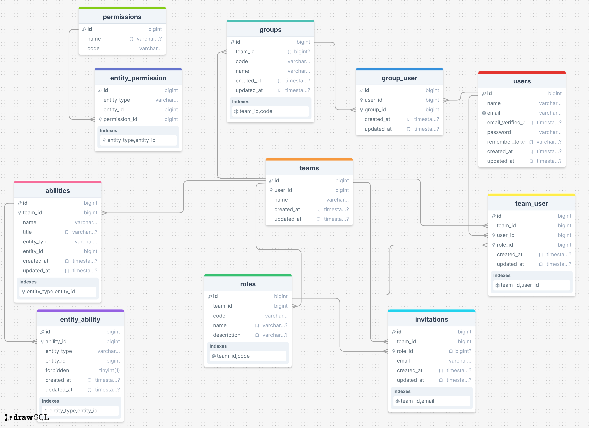

# Jurager/Teams
[](https://packagist.org/packages/jurager/teams)
[](https://packagist.org/packages/jurager/teams)
[](https://packagist.org/packages/jurager/teams)
[](https://packagist.org/packages/jurager/teams)

A Laravel package for managing teams and user permissions, supporting multi-tenant dynamic roles, role groups, and team-specific permissions.

Users can be organized into groups within teams, each with custom permissions and abilities. Permissions assigned to a user group override individual user permissions within a team.

Additionally, users can be added to a global group to grant them access across all teams with the group’s permissions. This feature is ideal for scenarios like providing support across multiple teams without the need to add users to each team individually.

> [!NOTE]
> The documentation for this package is currently being written. For now, please refer to this readme for information on the functionality and usage of the package.

- [Requirements](#requirements)
- [Schema](#schema)
- [Installation](#installation)
- [Teams](#teams)
- [Users](#users)
- [Groups](#groups)
    - [Scope of Use](#scope-of-use)
    - [Groups Managing](#groups-managing)
    - [Groups Abilities](#groups-permissions)
- [Roles & Permissions](#roles--permissions)
    - [Authorization](#authorization)
- [Abilities](#abilities)
  - [Adding an Ability](#adding-an-ability)
  - [Checking an Ability](#checking-an-ability)
  - [Forbidding an Ability](#forbidding-an-ability)
- [Middlewares](#middlewares)
  - [Middleware Configuration](#middleware-configuration)
  - [Middleware Routes](#middleware-routes)
  - [Middleware Usage](#middleware-usage)
- [License](#license)

Requirements
-------------------------------------------
`PHP >= 8.1` and `Laravel 8.x or higher`

Schema
-------------------------------------------


Installation
-------------------------------------------

```sh
composer require jurager/teams
```

Always **do backups**, next command **may overwrite your actual data.**

```sh
php artisan teams:install
```
Run the migrations

```sh
php artisan migrate
```

> [!NOTE]
> If you wish to use custom foreign keys and table names, make changes to config `config/teams.php`  before running migrations.


Then, add the `HasTeams` trait to your existing `User` model.

```php
<?php 

namespace App\Providers;

use Jurager\Teams\Traits\HasTeams;

class User extends Model {

    use HasTeams;
}
```

Teams
-------------------------------------------
A team can be accessed via `$user->team`, providing methods for inspecting the team's attributes and relations:

```php
// Access the team's owner...
$team->owner

// Get all the team's users, excluding owner
$team->users()

// Get all the team's users, including the owner...
$team->allUsers()

// Determine if the given user is a team member...
$team->hasUser(object $user)

// Adds a user to the team with a specified role by role ID or code
$team->addUser(object $user, string $role_keyword)

// Update the role of a specific user within the team
$team->updateUser(object $user, string $role_keyword)

// Remove the given user from the team.
$team->deleteUser(object $user);

// Get all the abilities belong to the team.
$team->abilities()

// Get all the team's roles.
$team->roles()

// Return the user role object from the team
$team->userRole(object $user)

// Check if the team has a specific role by ID or code or any roles at all
$team->hasRole(int|string|null $keyword)

// Get the role from the team by role id or code 
$team->getRole(int|string $keyword)

// Add new role to the team
$team->addRole(string $code, array $permissions)

// Update the role in the team
$team->updateRole(int|string $keyword, array $permissions)

// Deletes the given role from team
$team->deleteRole(int|string $keyword)

// Get all groups of the team.
$team->groups()

// Get team group by its id or code
$team->getGroup(int|string $keyword)

// Add new group to the team
$team->addGroup(int|string $keyword, string $name)

// Delete group from the team
$team->deleteGroup(int|string $keyword)

// Determine if the team has a member with the given email address...
$team->hasUserWithEmail(array $email)

// Determine if the given user is a team member with the given permission...
$team->userHasPermission(object $user, string|array $permissions, bool $require = false)

// Returns all team invitations
$team->invitations()
```

These methods allow you to efficiently manage and interact with teams, including roles, users, permissions, and invitations.

> [!NOTE]
> By default, the package uses the built-in model. If you want to use your own model, or specify a custom table name in the database, use the settings in the configuration file - `teams.models.team`, `teams.tables.teams`, `teams.foreign_keys.team_id`

Users
-------------------------------------------

The `Jurager\Teams\Traits\HasTeams` trait provides methods to inspect a user's teams:

```php
// Access the team's that a user belongs to...
$user->teams : Illuminate\Database\Eloquent\Collection

// Access all of a user's owned teams...
$user->ownedTeams : Illuminate\Database\Eloquent\Collection

// Access all the team's (including owned teams) that a user belongs to...
$user->allTeams() : Illuminate\Database\Eloquent\Collection

// Determine if a user owns a given team...
$user->ownsTeam(object $team) : bool

// Determine if a user belongs to a given team...
$user->belongsToTeam(object $team) : bool

// Get the role that the user is assigned on the team...
$user->teamRole(object $team) : \Jurager\Teams\Role

// Determine if the user has the given role on the given team...
$user->hasTeamRole(object $team, string|array 'admin', bool $require = false) : bool

// Access an array of all permissions a user has for a given team...
$user->teamPermissions(object $team) : array

// Determine if a user has a given team permission...
$user->hasTeamPermission(object $team, string|array 'server:create', bool $require = false) : bool

// Get list of abilities or forbidden abilities for users on certain model
$user->teamAbilities(object $team, object $server) : mixed

// Determine if a user has a given ability on certain model...
$user->hasTeamAbility(object $team, string 'server:edit', object $server) : bool

// Add an ability for user to action on certain model, if not found, will create a new one
$user->allowTeamAbility(object $team, string 'server:edit', object $server) : bool

// Forbid an ability for user to action on certain model, used in case if global ability or role allowing this action
$user->forbidTeamAbility(object $team, string 'server:edit', object $server) : bool
```

These methods enable you to efficiently manage and inspect a user's teams, roles, permissions, and abilities within your application.

Groups
-------------------------------------------

Users within teams can be organized into groups, each with its own set of abilities. 

> [!NOTE]  
> Access rights granted to a group of users take precedence over rights granted to a user within a team.

### Scope of Use

 * A user can `server:edit` within the team, but is part of a group restricted from `server:edit` for specific entities.

 * A user can't `server:edit` within the team, but is in a group permitted to `server:edit` specific entities.

### Groups Managing

The `Jurager\Teams\Traits\HasTeams` trait provides methods to inspect a user's team groups:

```php
// Add new group to the team
$team->addGroup(string $code, string $name)

// Delete group from the team
$team->deleteGroup(string $code)

// Get all groups of the team.
$team->groups();

// Check if the team has a specific group by ID or code or any groups at all
$team->hasRole(int|string|null $keyword)

// Get team group by its code
$team->getGroup(int|string $keyword);

// Get all group users
$team->getGroup(int|string $keyword)->users();

// Attach users or user to a group
$team->getGroup(int|string $keyword)->attachUser(Collection|Model $user);

// Detach users or user from group
$team->getGroup(int|string $keyword)->detachUser(Collection|Model $user);
```

### Groups Abilities

You can manage abilities within a group using the following methods:

```php
// Add an ability for user to action on certain model within team group, if not found, will create a new one
$user->allowTeamAbility(object $team, string 'server:edit', object $server, object|null $group));

// Forbid an ability for user to action on certain model within team group
$user->forbidTeamAbility(object $team, string 'server:edit', object $server, object|null $group);

// Delete user ability to action on certain model within team group
$user->deleteTeamAbility(object $team, string 'server:edit', object $server, object|null $group);
```
> [!NOTE]
> Team groups work together with abilities, so you should use ability checking methods to determine if users have specific access rights within groups.

```php
// Determinate if user can perform an action
$user->hasTeamAbility(object $team, string 'server:edit', object $server)
```

Middleware `ability` is used to check the user's rights within the team group during requests to your application

Refer to the [middlewares](#middlewares) section in the documentation for more information.

 Roles & Permissions
-------------------------------------------

> Roles and permissions offer a flexible approach to managing access control within your application. Each team member can be assigned a role, with each role tied to a specific set of permissions.

These roles and permissions are stored in your application's database, allowing for dynamic and easy management of access. This enables features like role and permission management through your application's admin interface.

**Example**: Creating a New Team with Roles and Permissions

```php
$team = new Team();

$team->name = 'Example Team';
$team->user_id = $user->id;

if ($team->save()) {

    $team->addRole('admin', [
        'employees.*',
        'sections.*',
        'articles.*',
        'tags.*',
        'comments.*',
        'team.edit',
        'stores.*',
        'plan.edit',
    ]);
    
    $team->addRole('user', [
        'employees.view',
        'articles.view',
        'articles.add',
        'sections.view',
        'sections.add',
        'comments.add',
        'tags.view',
        'stores.add',
        'stores.delete',
        'tags.add',
    ]);
}
```

In the above example, we create a new team and assign it two roles: "admin" and "user". Each role is associated with a set of permissions that define what actions users with that role can perform within the application.

The second argument for `$team->addRole()` is an array of permissions, which determine the actions that users with the corresponding role can perform in the application. These permissions are stored in the database and can be managed dynamically.

### Authorization

To ensure that incoming requests initiated by a team member can be executed by that user, the application needs to verify the permissions of the user's team. This verification can be done using the `hasTeamPermission` method, which is available through the `Jurager\Teams\Traits\HasTeams` trait.

> [!NOTE]  
> In most cases, checking a user's role is often unnecessary. Instead, prioritize verifying specific granular permissions, as roles mainly serve to group these permissions for organizational clarity. Typically, you’ll use this approach within your application's [authorization policies](https://laravel.com/docs/authorization#creating-policies).

```php
return $user->hasTeamPermission(string $server->team, string 'server:update');
```

This example demonstrates how to verify if a user within a team has permission to update a server. Adjust the parameters to fit your application's unique requirements and specific use cases.

Abilities
-------------------------------------------

> Abilities - enables users to perform specific actions on application entities or models.

For example, you can grant a user within a team the ability to edit posts.

Adding abilities to users is easy — just pass the ability name, and it’ll be created automatically if it doesn’t exist.


### Adding an Ability

To grant a user the ability to edit an article within a team, simply provide the relevant entities, such as the article and team objects:

```php
User::allowTeamAbility(object $team, string 'edit', object $article, object|null $group);
```

### Checking an Ability

Use the following method to verify if a user has a specific ability within a team:
    
```php
User::hasTeamAbility(object $team, string 'edit', object $article);
```

### Forbidding an Ability

To prevent a user from having a specific ability (even if their role allows it), use the following method:
```php
User::forbidTeamAbility(object $team, string 'edit', object $article, object|null $group);
```

Middlewares
-----------------------------------------

### Middleware Configuration

The middleware provided by this package is automatically registered as `role`, `permission`, and `ability`.

However, if you wish to use your own customized middlewares, you can modify the `middleware.register` in the `config/teams.php`.

### Middleware Routes

You can use middleware to filter routes and route groups based on permissions or roles. 

> [!NOTE]  
> Consider, that `team_id` represents the actual ID of the team in the database.

If you need to customize the name of this variable, adjust the `foreign_keys.team_id` value in your `config/teams.php` file to match your database structure.


```php
Route::group(['prefix' => 'admin', 'middleware' => ['role:admin,team_id']], function() {
    Route::get('/users', 'UserController@usersIndex');
    Route::get('/user/edit', ['middleware' => ['permission:edit-users,team_id'], 'uses' => 'UserController@userEdit']);
});
```

> [!NOTE]  
> Middleware logic may vary based on how you pass the `team_id` variable.

* You can pass the `team_id` variable as a route parameter:

```php
Route::get('/{team_id}/users', ['middleware' => ['permission:views-users'], 'uses' => 'CommonController@commonUsers']);
```

* You can pass the `team_id` variable directly as a middleware option:

```php
'middleware' => ['role:admin|root,team_id']
```

* You can send the `team_id` variable with each request type (GET/POST/PUT, etc.).

### Middleware Usage

For **OR** operations, use the pipe symbol:

```php
'middleware' => ['role:admin|root,team_id']
// $user->hasTeamRole($team, ['admin', 'root']);

'middleware' => ['permission:edit-post|edit-user']
// $user->hasTeamPermission($team, ['edit-post', 'edit-user']);
```

For **AND** functionality:

```php
'middleware' => ['role:admin|root,team_id,require']
// $user->hasTeamRole($team, ['admin', 'root'], require: true);

'middleware' => ['permission:edit-post|edit-user,team_id,require']
// $user->hasTeamPermission($team, ['edit-post', 'edit-user'], require: true);
```

To check the ability to perform an action on a specific model item, use the ability middleware:
    
```php
'middleware' => ['ability:edit,App\Models\Article,atricle_id']
// $user->hasTeamAbility($team, 'edit', $article);
```

In this case, pass `article_id` as a request parameter or route parameter to allow the package to identify the model object.

## License

This package is open-sourced software licensed under the [MIT license](LICENSE.md).